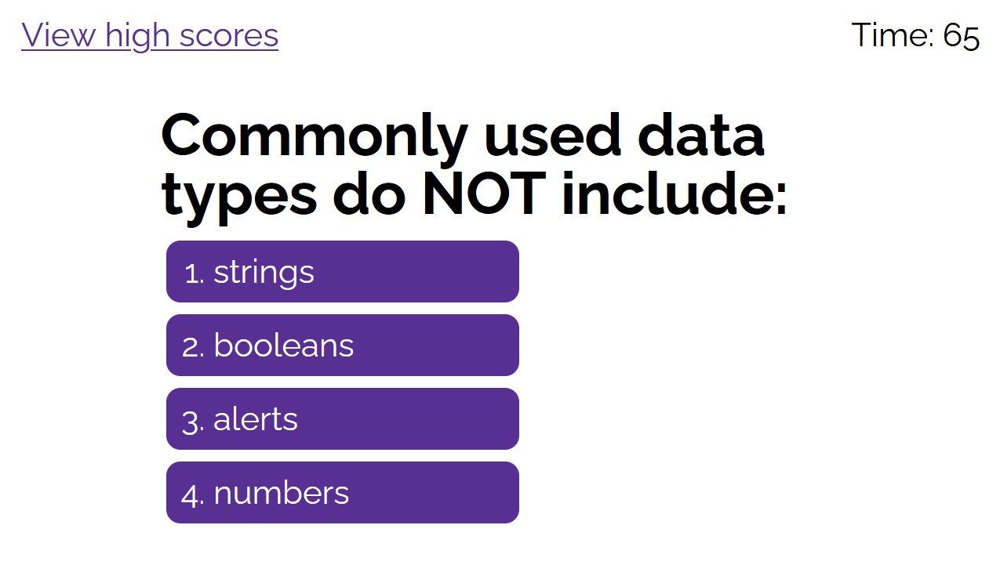

# Module 4 Weekly Challenge - Timed Coding Quiz

## Description

When learning about and engaging with a new field of knowledge, it is important to periodically test said knowledge to see how well you are doing. It allows you an insight into where you're doing well, and where you need to improve. As such, this web application provides the opportunity to test your basic coding knowledge, and to submit the results to a local database to see how your performance compares to others.

## Usage

Take the coding quiz here;

https://average-kirigiri-enjoyer.github.io/challenge-4-code-quiz/

On the page, you will be greeted by three things. First, a view high scores link in the top left, which can be clicked at any time to view any available high scores. Note that switching to the high scores menu will end an in-progress quiz attempt without a submission. There will be a menu in the middle of the page giving a brief description of the quiz, and a start button which you can press to begin the quiz. There will also be a timer in the top right which will begin counting down when you start the quiz.

When the quiz begins, there will be a question title in bold text, with four multiple-choice options below. Upon clicking on one of the options, you will proceed to the next question. You will receive a message below the quiz contents on whether or not your answer was correct. If you answered incorrectly, the time limit will be reduced by 10 seconds. Upon the time limit hitting 0, or all questions being answered, the quiz will end and switch to the score submission menu. Enter your initials and click the submit button to add your score (the amount of time remaining once you complete the quiz) to the local database of high scores. Note that you must input text into the input box for your submission to be accepted, and you can only make one submission per completed quiz attempt.

In the high score menu, the scores will be listed in the middle of the screen. Below, there will be a back button which will return you to the quiz start menu, and a clear high scores button, which will wipe all high score data from the local database, and clear all the listings from the menu.

## Preview

## Credits

reset.css file (./assets/reset.css);
https://meyerweb.com/eric/tools/css/reset/

raleway font (index.html, line 19);
https://fonts.google.com/specimen/Raleway

[selector] > * syntax (./assets/style.css, line 74, 102, 109);
https://linuxhint.com/css-apply-all-children/

word-wrap syntax (./assets/style.css, line 201);
https://www.w3schools.com/cssref/css3_pr_word-wrap.php

## License

Operates under a standard MIT license, refer to the LICENSE file in the repository for more information.
